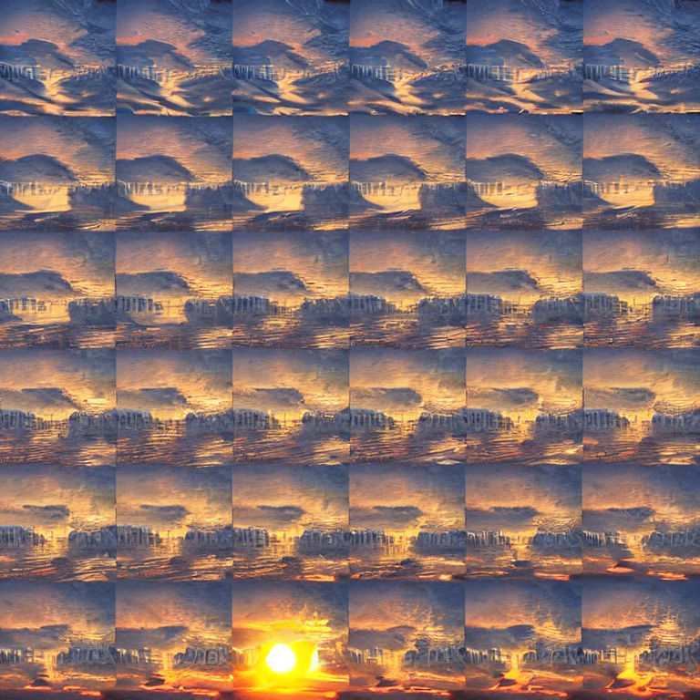

Hi Lucas, hi Triggerhappygandhi. Thank you for your interest in this. 
So the idea is just to turn videos from [WebVid10M](https://m-bain.github.io/webvid-dataset/) into image grids, and train SD to generate those.
For training, I am using the [Stable Tuner](https://github.com/devilismyfriend/StableTuner) library: this is me giving up on trying to install xformers on ubuntu.

I have also uploaded a trained model at [https://huggingface.co/nepyope/stable_giffusion/tree/main](https://huggingface.co/nepyope/stable_giffusion/tree/main). 
This model was trained on approximately 2k image grids, and while it does generate image grids, the output is completely incoherent.

